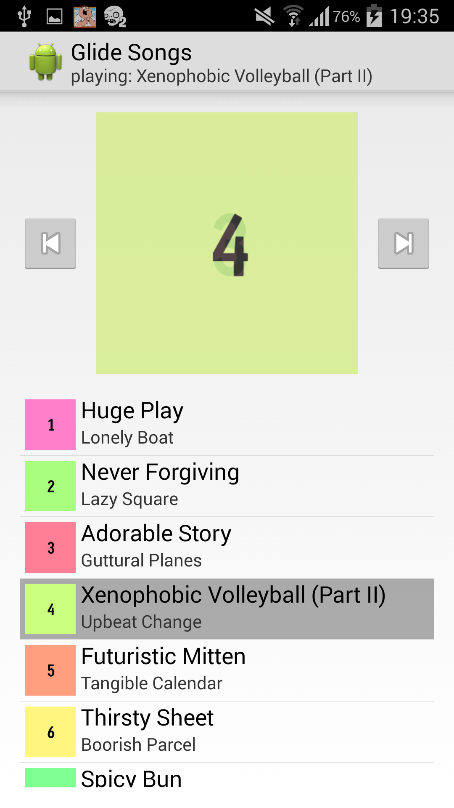

Glide Songs
===========
This is a pretend music player with random generated song and artist names.



Purpose
-------
This project is here to demonstrate https://github.com/bumptech/glide/issues/132

How crossfade is used the same way in the list and as the album cover, but as users we'd expect different behaviours.

Development
-----------
Seamsless import in Android Studio.

Try it
------
```
gradlew runDebug
```
Note: _don't forget to plug your device in first_!

History
-------
Code was migrated from https://github.com/TWiStErRob/TWiStErRob/tree/ddacabac3b51690b354f221d92f59348ef5ac577/GlideSongs
History: https://github.com/TWiStErRob/TWiStErRob/commits/ddacabac3b51690b354f221d92f59348ef5ac577/GlideSongs
